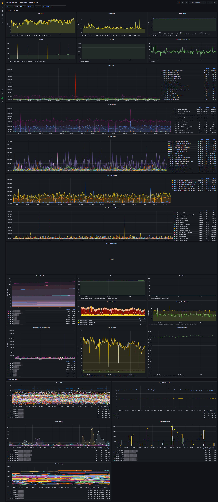

# Rust Server Metrics
A metrics gathering HarmonyMod for [Rust](https://playrust.com) game servers.



# Basic Setup Guide
1. Install Grafana and InfluxDb v1.8 (v2.0+ is not compatible) on a server
2. Set the InfluxDb config variable `max-series-per-database` to 0, this is required due to the volume of data that is stored for player based metrics
> **NOTE**: Failure to do this will eventually result in metrics submission failures and the loss of data
3. Restart InfluxDb to apply the config change
4. Create a database in InfluxDb with an appropriate retention policy
> **NOTE**: A good starting point for a retention policy is a total duration of 12 weeks and a shard group duration of 24 hours
5. Create a user with `write` permissions on the newly create database
6. Import the [Dashboard](https://github.com/Pinkstink-Rust/Rust-Server-Metrics/releases/latest/download/Grafana-Dashboard.json) into Grafana and Configure the DataSource variable
7. Stop your Rust server, **see warning below**
8. Download the latest version of [RustServerMetrics.dll](https://github.com/Pinkstink-Rust/Rust-Server-Metrics/releases/latest/download/RustServerMetrics.dll) from this projects [latest release](https://github.com/Pinkstink-Rust/Rust-Server-Metrics/releases/latest) and copy it to the `HarmonyMods` folder in your rust server directory
9. Start your Rust Server, **see warning below**
10. Once the server has started and the mod has loaded, setup your configuration file located `HarmonyMods_Data/ServerMetrics/Configuration.json`
11. Reload the configuration file by issuing the command `servermetrics.reloadcfg`

> **WARNING**: Never update or delete a HarmonyMod DLL file when the rust server is running, this can lead to your server throwing random Invalid IL exceptions and eventually crash

# Configuration
## Sample
 `HarmonyMods_Data/ServerMetrics/Configuration.json`
```json
{
  "Enabled": true,
  "Influx Database Url": "https://my-influx-database:8086",
  "Influx Database Name": "rust-server-metrics",
  "Influx Database User": "my-database-user",
  "Influx Database Password": "my-super-secret-password-thats-a-decent-size",
  "Server Tag": "us-10x",
  "Debug Logging": false,
  "Amount of metrics to submit in each request": 400
}
```

## Explanation
### Enabled
If set to true, the mod will collect and submit metrics to your configured InfluxDb.

### Influx Database Url
The Url that your InfluxDb is accessible at.

> **NOTE**: It is highly recommended that you setup a valid SSL certificate for this if you plan to access the database over the internet

### Influx Database Name
The name of the database setup in step 4.

### Influx Database User
The username of a user created in step 5.

### Influx Database Password
The password for the user created in step 5.

### Server Tag
This is a static tag that is added to all records submitted by your rust server to the database, this tag should be different for each rust server

> **TIP**: You can have multiple rust game servers submit data the same InfluxDb database if you use different server tags for them

### Debug Logging
Setting this to true with output the raw HTTP response for failed submission attempts, it is reccomended to disable this once your server is up and connected as it can cause performance issues.

### Amount of metrics to submit in each request
This field configures exactly how many individual statistics records should be sent in each HTTP request, too high will result in sending of records taking large amounts of time and potentially causing FPS issues on your server, too low and the Mod will begin discarding records as they are being generated faster than they are being sent.

> **NOTE**: 200 -> 600 pop servers have been tested without issue with this set to 400

# Commands
### servermetrics.reloadcfg
If you have made changes to the config file directly, you can run this console command and it will load the changes.

### servermetrics.status
This command will output whether the Mod is ready to collect metrics, whether the report uploader is sending a http request and how many records are in the send buffer.

# Remarks
### Report Buffer Size
The report buffer is hardcoded to a size of 10,000 reports, once this buffer size is exceeded, the Mod will begin to discard reports, of which will cause data to be missing from your Grafana dashboard.

If you plan to play around with the `Amount of metrics to submit in each request` configuration variable, ensure you watch the size of the report buffer.